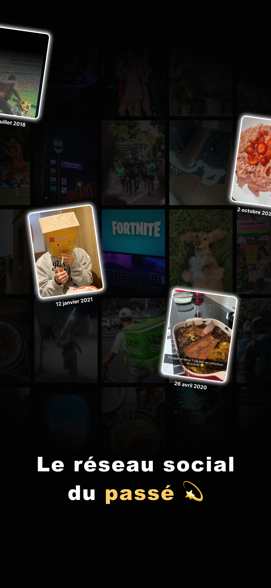
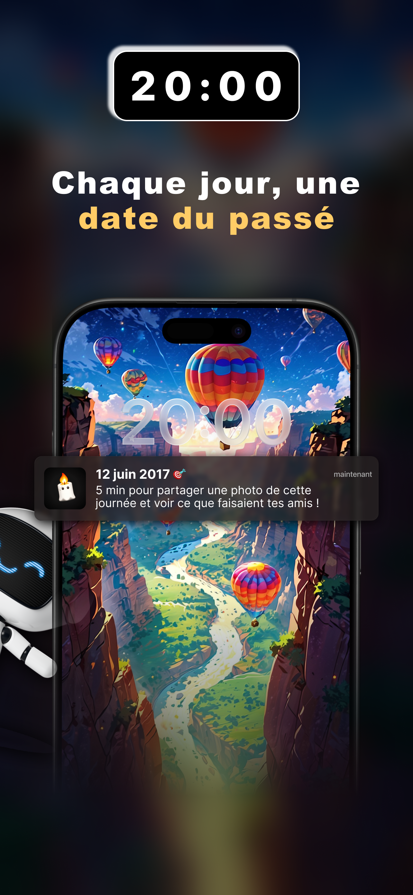
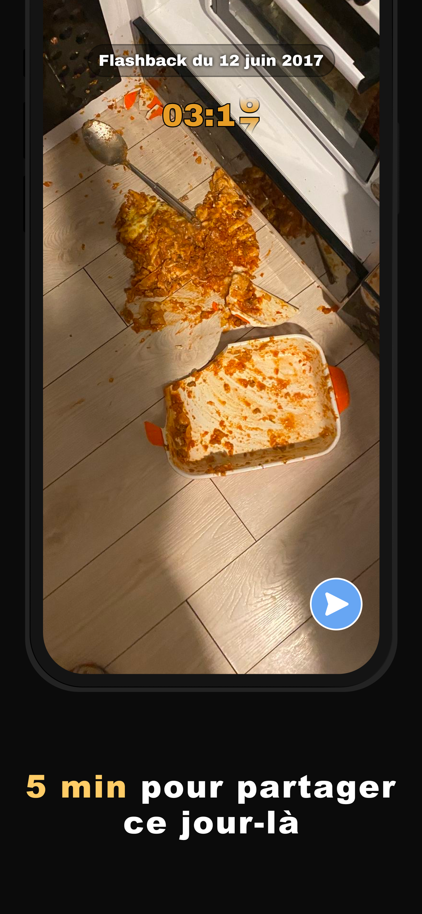
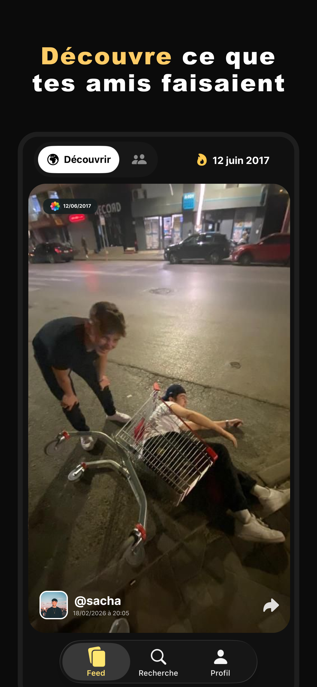
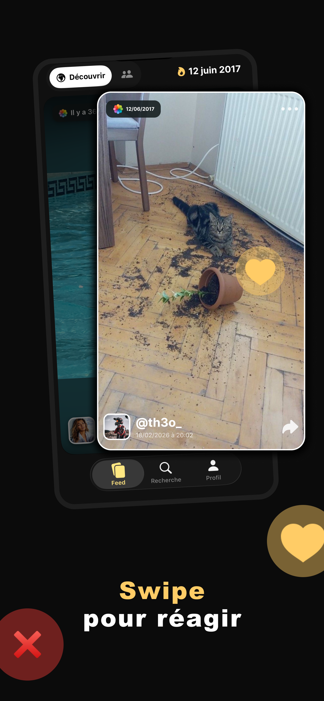

# Melric Lacoste — iOS Engineer · Full-Stack Mobile

Building production-grade iOS apps with a focus on architecture, caching, and performance.  
Founder of **Yester** — a social memory app live on the App Store.

[](https://linkedin.com/in/melric-lacoste)
[](mailto:mel.lacoste.pro@gmail.com)

---

## What I build

I design and ship iOS apps end-to-end — from SwiftUI architecture to backend infrastructure.  
My focus: offline-first experiences, multi-layer caching, and GraphQL pipelines that scale.

---

## Featured — [Yester: On This Day](https://apps.apple.com/fr/app/yester-on-this-day/id6759684119)

> *Every day at 8PM, a random past date drops. You have 5 minutes to share a photo from that day. Then discover what your friends were up to.*

A social memory app built entirely solo — product, iOS, and backend.

**Architecture highlights**
- Multi-layer cache (Memory + Core Data + Redis + ETag) — **85–90% hit rate**, 60% fewer network transfers
- Denormalized fan-out feed (Instagram pattern) — eliminates client-side N+1 queries, optimistic updates
- Serverless GraphQL backend (Firebase Cloud Functions) — designed to absorb **100K uploads in 5 minutes**
- ETag-based sync for data consistency at scale
- CI/CD with GitHub Actions + Fastlane

**Screenshots**

<table>
<tr>
<td></td>
<td></td>
<td></td>
<td></td>
<td></td>
</tr>
</table>

**Stack**
```
iOS      SwiftUI · UIKit · Combine · MVVM · Core Data · Swift Concurrency
Backend  Node.js · Apollo GraphQL · Redis · Firebase Cloud Functions
Services Algolia · RevenueCat · OneSignal
DevOps   GitHub Actions · Fastlane
```

---

## Other projects

### Yakabi — Daily Photo Roulette *(indie, 2025)*
Photo-sharing app with a contact-matching system built on hashing + indexing.  
Near-instant matching across 10K+ contacts · reactive cache (Combine + ETag) cutting server requests by ~60%.

### Diagoris — CSE Communication Platform *(Remote, 2024)*
Built the iOS app from scratch with no existing technical foundation.  
Smart pagination + prefetching · memory optimizations (lazy loading, cache invalidation).

> *Repos are private — happy to walk through architecture and decisions in a call.*

---

## Skills

| | |
|---|---|
| **iOS** | Swift, SwiftUI, UIKit, Combine, Swift Concurrency |
| **Architecture** | MVVM, Clean Architecture, Offline-First, Dependency Injection |
| **Data & Cache** | Core Data, Apollo GraphQL, Redis, ETag, Offline-First |
| **Backend** | Node.js, TypeScript, Firebase Cloud Functions, GraphQL serverless |
| **Tooling** | Git, GitHub Actions, Fastlane, XCTest, XCUITest, Figma |

---

## Open to

- Full-time (CDI) or freelance missions
- Full remote or hybrid
- Available now

---

*Based in France · English & French*
